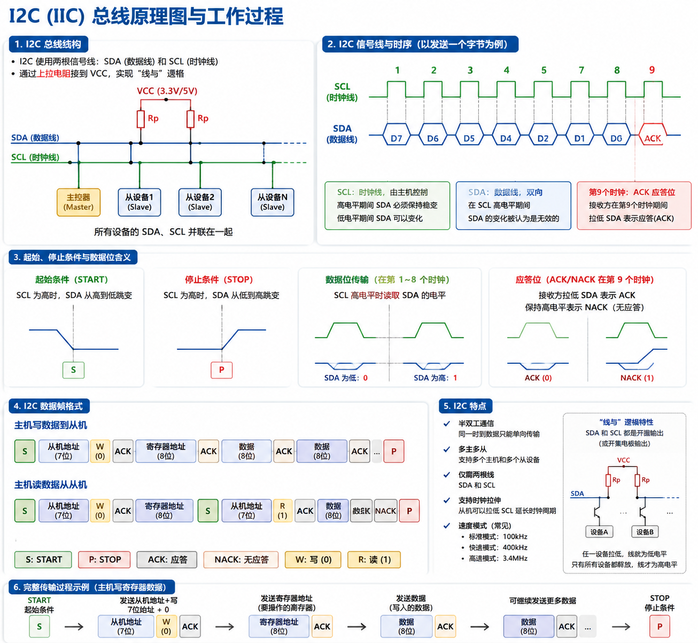

# 第 26 课：I2C 基础

## 1. 本课到底在学什么

本课表面现象是：STM32 通过 I2C1 向 AT24C02 EEPROM 的 `0x00` 地址写入 1 个字节，再读回来比较；如果读写一致，PC13 LED 周期翻转。

真正要学的是 I2C 总线的一次完整事务：

```text
START
  -> 发送器件地址
  -> 从机 ACK
  -> 发送 EEPROM 内部地址
  -> 发送或读取数据
  -> STOP
```

读 EEPROM 时还会出现更重要的一步：

```text
先写内部地址 -> 重复起始 RESTART -> 再切到读方向 -> 读数据
```

这节课要把现象层、物理总线层、I2C1 外设层、寄存器 bit 层、C/CMSIS 层和 HAL 工程层全部连起来。否则你只会背 `HAL_I2C_Mem_Read()`，一旦遇到 `ADDR` 卡住、`AF` 置位、总线一直 `BUSY`，就不知道该查哪里。

在体系中的位置：前 25 课覆盖了 GPIO、时钟、UART 和协议解析。本课是第一个 I2C 课程，从串口通信转向板上总线通信。I2C 是后续 MPU6050、OLED、EEPROM 扩展课程的基础。

## 2. 本课学习目标

学完本课，你应该能回答：

1. I2C 为什么只用 SCL/SDA 两根线？
2. 为什么 I2C 引脚必须配置成开漏，而不是推挽？
3. AT24C02 的 7 位地址 `0x50` 为什么发送时会变成 `0xA0` 或 `0xA1`？
4. `CR2.FREQ=36`、`CCR=180`、`TRISE=37` 分别控制什么？
5. `START`、`ADDR`、`TXE`、`BTF`、`RXNE` 这些标志分别表示哪一步完成？
6. 为什么清除 `ADDR` 必须先读 `SR1` 再读 `SR2`？
7. 为什么 EEPROM 写完后要等约 10ms 再读？
8. `HAL_I2C_Mem_Write()` 和寄存器版写字节流程如何对应？
9. `HAL_I2C_Mem_Read()` 为什么内部需要重复起始？

## 3. 本课目录结构

```text
26_i2c_basic/
├── README.md
├── reg/
│   ├── platformio.ini
│   └── src/main.c
└── hal/
    ├── platformio.ini
    └── src/main.c
```

`reg/` 直接操作 I2C1 寄存器，并把 START、ADDR、BTF、RXNE 等流程摊开。
`hal/` 使用 `I2C_HandleTypeDef`、`HAL_I2C_Init()`、`HAL_I2C_Mem_Write()`、`HAL_I2C_Mem_Read()` 完成同一件事。

## 4. 实验硬件

- 开发板：STM32F103C8T6 BluePill
- 下载器：ST-Link
- 外部模块：AT24C02 EEPROM 模块
- I2C 引脚：PB6 = I2C1_SCL，PB7 = I2C1_SDA
- LED：PC13，常见 BluePill 为低电平点亮

接线：

```text
AT24C02 VCC -> 3.3V
AT24C02 GND -> GND
AT24C02 SCL -> PB6
AT24C02 SDA -> PB7
```

很多 EEPROM 模块自带 4.7k 上拉电阻。如果你的模块没有上拉，SCL/SDA 必须外接上拉到 3.3V，否则总线高电平不能可靠形成，I2C 通信会失败。

## 5. 先建立一个最基本的脑图

```text
72MHz 系统时钟
  -> APB1 = 36MHz
  -> I2C1 时序计算基于 PCLK1

PB6/PB7 复用开漏
  -> 外部上拉把总线释放成高电平
  -> 任意设备只能主动拉低

I2C1 初始化
  -> CR2.FREQ = 36
  -> CCR = 180，得到 100kHz SCL
  -> TRISE = 37
  -> PE = 1 打开 I2C

写 EEPROM
  -> START -> 0xA0 -> 内部地址 -> 数据 -> STOP

读 EEPROM
  -> START -> 0xA0 -> 内部地址
  -> RESTART -> 0xA1 -> 读 1 字节 -> STOP

比较结果
  -> 一致则 PC13 翻转
  -> 失败则 PC13 点亮作为错误提示
```

本课最关键的因果关系是：I2C 电气层要求开漏和上拉；I2C 时序层要求正确 PCLK1、CCR、TRISE；I2C 协议层要求地址、ACK、重复起始按顺序出现。三层中任何一层出错，通信都会失败。

## 6. 核心名词解释

### 6.1 已学名词速查

以下名词在前 4 课已完整讲解，本课只用不重复展开：

| 名词                             | 一句话提醒                                                                            |
| -------------------------------- | ------------------------------------------------------------------------------------- |
| `system_clock_72mhz_init()`    | 配置 HSE+PLL 产生 72MHz，PCLK1=36MHz 给 I2C1 提供时钟基准                             |
| `PCLK1=36MHz`                  | APB1 总线时钟，I2C1 挂在 APB1 上，CR2.FREQ 和 CCR 的计算都依赖这个值                  |
| `pc13_led_init()`              | 打开 GPIOC 时钟，PC13 配推挽输出，默认高电平灭 LED                                    |
| `GPIOC->BSRR` / `GPIOC->BRR` | 位设置/位复位寄存器，BSRR 写 BS13 拉高 LED 灭，BRR 写 BR13 拉低 LED 亮                |
| `SysTick`                      | 24 位递减定时器，本课用 72MHz÷72000=1kHz 产生 1ms 中断，驱动`g_ms_ticks`           |
| `delay_ms()`                   | 基于`g_ms_ticks` 的毫秒延时，EEPROM 写后等待 10ms 依赖这个函数                      |
| `GPIOB->CRL`                   | GPIOB 低 8 位引脚（含 PB6/PB7）的配置寄存器，MODE=11 表 50MHz 输出，CNF=11 表复用开漏 |
| `RCC->APB1ENR`                 | APB1 外设时钟使能寄存器，I2C1 的时钟在这里打开                                        |
| `RCC->APB2ENR`                 | APB2 外设时钟使能寄存器，GPIOB、AFIO 的时钟在这里打开                                 |
| `FLASH->ACR`                   | Flash 访问控制寄存器，72MHz 需要等 2 个 Flash 等待周期                                |

### 6.2 I2C 总线

I2C 是一种同步串行总线，用两根线（SCL 时钟 + SDA 数据）连接多个器件。主设备产生 SCL 节拍，所有设备在节拍上收发数据。

它属于板级通信层和芯片外设层之间的接口。STM32 的 I2C1 外设负责产生 START、STOP、ACK 和 SCL 时序，AT24C02 作为从机响应地址并读写内部存储单元。

本课为什么需要它：I2C 是板上芯片间通信的主流协议，只需两根线就能连接多个设备。后续 MPU6050 传感器、OLED 显示屏、外部 EEPROM 扩展都依赖 I2C。不理解 I2C 就无法理解这些外设的数据交互。

配错会怎样：如果把 I2C 当成 UART 来理解，就会误以为两端各自按波特率收发。实际上 I2C 有主机时钟，所有位都跟着 SCL 走。SCL 频率算错（CCR 填错），从机无法正确采样数据位，通信完全失败。如果忘了上拉电阻，总线高电平无法形成，START 条件永远无法产生。

### 6.3 开漏输出

开漏输出表示器件只能主动拉低总线，不能主动推高总线；高电平依靠上拉电阻形成。

它属于物理/电气层，是 I2C 能多个设备共享总线的原因。多个器件同时接在 SDA 上时，只要任何一个器件拉低，总线就是低；没有器件拉低时，上拉电阻把总线拉高。推挽输出则不同——两个设备同时输出相反电平时会直接短路，轻则通信异常，重则烧 IO。

本课为什么需要它：PB6/PB7 必须配成复用开漏（`GPIO_CRL_CNF6=11` 或 `GPIO_MODE_AF_OD`），这是 I2C 总线电气特性的硬性要求，不是可选项。

配错会怎样：如果错配成推挽输出（`CNF=10` 或 `GPIO_MODE_AF_PP`），两个设备可能一个输出高、一个输出低，轻则通信异常，重则烧 IO。如果忘了外接上拉电阻，SCL/SDA 高电平无法形成，START 条件无法产生，`SB` 标志永不置位，`HAL_I2C_Mem_Write()` 返回 `HAL_ERROR`。

### 6.4 PB6/PB7

PB6 和 PB7 是 GPIOB 的引脚，也是 STM32F103 上 I2C1 的默认复用引脚。PB6=I2C1_SCL（串行时钟），PB7=I2C1_SDA（串行数据）。

它们属于引脚复用层。代码必须先打开 GPIOB 时钟，再在 `GPIOB->CRL` 中把它们配成复用开漏输出。`MODE=11` 表示 50MHz 输出能力，`CNF=11` 表示复用开漏输出。

配错会怎样：如果线接到 PB8/PB9，但代码没有做 I2C1 重映射，I2C1 默认信号不会出现在那些引脚上，通信失败。如果 CNF 配成 10（推挽）而非 11（开漏），见 6.3 节的后果。

### 6.5 AT24C02

AT24C02 是一颗 I2C EEPROM，容量 2Kbit（256 字节）。本课假设 A0/A1/A2 地址脚接地，7 位 I2C 地址是 `0x50`。

它属于外部器件层。EEPROM 的特点是掉电不丢数据，但写入需要内部编程时间（典型 5ms，最大 10ms）。当前代码写完后等待 10ms，再读回校验。如果不等，读回可能还是旧值，或者设备在写周期中不响应 ACK（`AF` 置位）。

配错会怎样：A0/A1/A2 的接法改变 7 位地址。如果模块上这三个脚不是接地而是接 VCC，地址就不再是 `0x50`，`ADDR` 不会置位，`AF` 会置位。

### 6.6 7 位地址与 8 位地址字节

I2C 常说的设备地址通常是 7 位地址。AT24C02 在本课中的 7 位地址是 `0x50`（1010000）。在线上传输时，地址字节最低位还要放 R/W 位：

- 写：`0x50 << 1 | 0 = 0xA0`
- 读：`0x50 << 1 | 1 = 0xA1`

它属于协议层。寄存器版手动发送 `0xA0/0xA1`，HAL 版传入左移后的 `0xA0`（即 `AT24C02_ADDR_HAL`），HAL 根据读写方向自动处理最低位。

配错会怎样：地址错时，典型现象是 `ADDR` 不置位，`AF` 置位，LED 进入错误提示。常见错误是把 `0x50` 直接写入 DR 而不左移——此时从机收到的地址是 `0x28`（`0x50>>1`），匹配不到任何设备。

### 6.7 START 和 STOP

START 是 I2C 起始条件：SCL 为高时，SDA 从高变低。寄存器版设置 `I2C_CR1_START`，硬件自动在 PB6/PB7 上产生起始条件，完成后 `SR1.SB` 置位。没有 START，从机不会把后面的地址当成一次新通信的开始。

STOP 是 I2C 停止条件：SCL 为高时，SDA 从低变高。寄存器版设置 `I2C_CR1_STOP`，硬件产生 STOP 并释放总线。STOP 后 `SR2.BUSY` 最终应回到 0。

本课为什么需要它们：START/STOP 是 I2C 通信的边界标记。没有 START，从机不理你；没有 STOP，总线一直被占用，下一次通信前等待 `BUSY` 可能超时。

配错会怎样：如果 STOP 没发出或总线被从机拉住，`BUSY` 一直为 1，后续所有 I2C 操作都会在 `i2c1_wait_bus_free()` 中超时。

### 6.8 ACK/NACK

ACK 是应答，NACK 是不应答。I2C 每传完 8 bit 后，第 9 个时钟由接收方回应。主机发送地址后，如果从机存在且地址匹配，就拉低 SDA 给 ACK，STM32 硬件再置位 `ADDR`。

它属于协议层和硬件状态层之间的桥梁。如果收到 NACK，寄存器版会看到 `SR1.AF`。常见原因是地址错、设备没供电、SCL/SDA 没上拉、接线错误。

本课为什么需要它：ACK/NACK 是 I2C 唯一的错误反馈机制。没有 ACK，主机不知道从机是否收到了数据。单字节读时，主机必须在最后一个字节前关 ACK（发 NACK），告诉从机"不要再发了"——否则从机会继续发送，下一个字节覆盖 DR。

配错会怎样：单字节读时忘了关 ACK，主机发 ACK 后从机继续发送，`RXNE` 再次置位但数据被覆盖，读到的不是最后一个字节。

### 6.9 I2C1 寄存器：CR1、CR2、CCR、TRISE、SR1、SR2、DR、OAR1

这些是 I2C1 外设的寄存器，属于寄存器/bit 层。

- **CR1**：控制寄存器 1。`PE` 打开 I2C，`ACK` 控制应答，`START` 产生起始条件，`STOP` 产生停止条件。
- **CR2**：保存 APB1 时钟频率（单位 MHz）。本课 `FREQ=36`，因为 PCLK1=36MHz。I2C 硬件用这个值计算内部时序。
- **CCR**：时钟控制寄存器。标准模式 100kHz 下 `CCR = PCLK1 / (2 × Fscl) = 36MHz / 200kHz = 180`。如果 CCR 太小，SCL 过快，EEPROM 响应不稳定；太大则通信变慢。
- **TRISE**：最大上升时间寄存器。标准模式 `TRISE = PCLK1(MHz) + 1 = 37`。I2C 高电平由上拉电阻形成，上升沿不像推挽那样陡，这个值告诉硬件最长允许等多久。
- **SR1**：状态寄存器 1。`SB`=START 已发送，`ADDR`=地址已发送且收到 ACK，`TXE`=发送数据寄存器空，`BTF`=字节传输完成，`RXNE`=接收数据寄存器非空，`AF`=应答失败。
- **SR2**：状态寄存器 2。`BUSY`=总线忙。`ADDR` 的清除方式是先读 SR1 再读 SR2——这是 F103 I2C 硬件的规定动作，少一步或顺序错，硬件状态可能卡住。
- **DR**：数据寄存器。写 DR 发送字节，读 DR 接收字节。
- **OAR1**：自身地址寄存器 1。本课 STM32 只做主机，但 F103 硬件要求 `ADDMODE` 位必须置 1，否则初始化可能异常。

配错会怎样：

- `FREQ` 填 72（而非 36）：CCR 计算基于错误时钟，SCL 实际频率偏移，通信失败。
- `CCR` 填 0 或不填：SCL 频率不确定，可能超快或超慢。
- 清 `ADDR` 只读 SR1 不读 SR2：ADDR 不清除，状态机卡在地址阶段，后续数据无法收发。
- `PE` 没打开：I2C1 外设不工作，所有寄存器操作无效。

### 6.10 重复起始 RESTART

重复起始是在不发送 STOP 的情况下再次发送 START。读 EEPROM 的随机地址时，主机先以写方向告诉 EEPROM"我要读哪个内部地址"，再用重复起始切换到读方向读取数据。

它属于协议时序层。若中间发 STOP，有些设备会改变内部地址指针行为；使用重复起始是随机读的标准流程。

配错会怎样：如果在两段之间发了 STOP 而不是 RESTART，EEPROM 可能把内部地址指针复位，读到的不是目标地址的数据，而是当前地址指针指向的数据。

### 6.11 HAL_I2C_Mem_Write() 和 HAL_I2C_Mem_Read()

这两个是 HAL 用于"带内部地址设备"的读写函数。

`HAL_I2C_Mem_Write()` 封装寄存器版的完整写事务：START → 地址+写 → 清 ADDR → 发内部地址 → 等 TXE/BTF → 发数据 → 等 BTF → STOP。参数 `&hi2c1` 绑定 I2C1，`AT24C02_ADDR_HAL` 是左移后的器件地址，`EEPROM_MEM_ADDR` 是内部地址，`I2C_MEMADD_SIZE_8BIT` 表示内部地址是 8 位。

`HAL_I2C_Mem_Read()` 封装随机读流程：START → 地址+写 → 内部地址 → RESTART → 地址+读 → 接收数据 → STOP。单字节读时，HAL 还会处理 ACK/NACK 和 STOP 的时序。

配错会怎样：如果返回不是 `HAL_OK`，说明底层某一步超时、NACK 或错误。需要检查接线、上拉、地址、器件供电。

### 6.12 I2C_HandleTypeDef

`I2C_HandleTypeDef` 是 HAL 管理 I2C 外设的句柄结构体。`Instance` 字段绑定具体外设（`I2C1`），`Init` 字段保存配置参数（`ClockSpeed`、`DutyCycle`、`AddressingMode` 等）。

HAL API 通过这个句柄知道要操作哪个 I2C 外设、当前处于什么状态、超时和错误码如何记录。它对应寄存器版中分散的 `I2C1->CR1`、`I2C1->CR2`、`I2C1->CCR` 等寄存器操作，把配置集中管理。

## 7. 寄存器版代码讲解

### 7.1 已学步骤（快速过）

以下步骤在前 4 课已逐条拆解，本课用列表方式快速过：

- `system_clock_72mhz_init()`：FLASH 等 2 周期 → 开 HSE → 等 HSE 稳定 → 配 PLL 9 倍频 → 等 PLL 稳定 → 切 SYSCLK 到 PLL。结果为 72MHz，PCLK1=36MHz（APB1 二分频）。
- `systick_init()`：SysTick LOAD=71999（72MHz÷72000=1kHz），使能中断和计数器。`SysTick_Handler` 每 1ms 递增 `g_ms_ticks`。
- `delay_ms()`：基于 `g_ms_ticks` 的忙等延时，EEPROM 写后等待 10ms 依赖此函数。
- `led_pc13_init()`：开 GPIOC 时钟 → 清 CRH 的 MODE13/CNF13 → 设 MODE13=01（10MHz 推挽输出）→ BSRR 写 BS13 拉高，LED 熄灭。
- `led_on()` / `led_off()` / `led_toggle()`：通过 BRR/BSRR 控制 PC13 电平，对应 LED 亮灭翻转。

### 7.2 i2c1_gpio_init()：打开三个时钟 [本课新增]

```c
RCC->APB2ENR |= RCC_APB2ENR_IOPBEN;   // GPIOB 时钟
RCC->APB2ENR |= RCC_APB2ENR_AFIOEN;   // 复用功能时钟
RCC->APB1ENR |= RCC_APB1ENR_I2C1EN;   // I2C1 时钟（注意：APB1！）
```

三个时钟缺一不可。GPIOB 用于 PB6/PB7 引脚，AFIO 支持引脚复用功能，I2C1 本体在 APB1。注意 I2C1 在 APB1（PCLK1=36MHz），不在 APB2（PCLK2=72MHz）——这个区别对后续 CCR 和 TRISE 的公式计算至关重要。

### 7.3 配置 PB6/PB7 为复用开漏 [本课新增]

```c
GPIOB->CRL &= ~(GPIO_CRL_MODE6 | GPIO_CRL_CNF6 |
                GPIO_CRL_MODE7 | GPIO_CRL_CNF7);

GPIOB->CRL |= GPIO_CRL_MODE6;   // MODE6 = 11
GPIOB->CRL |= GPIO_CRL_CNF6;    // CNF6 = 11：复用开漏
GPIOB->CRL |= GPIO_CRL_MODE7;   // MODE7 = 11
GPIOB->CRL |= GPIO_CRL_CNF7;    // CNF7 = 11：复用开漏
```

PB6/PB7 是低 8 位引脚（0~7），在 CRL 中配置。`MODE=11` 表示 50MHz 输出能力，`CNF=11` 表示复用开漏输出。硬件后果：PB6/PB7 被 I2C1 接管，只能主动拉低，总线释放时由上拉电阻拉高。如果错配成 `CNF=10`（复用推挽），两个设备同时输出相反电平会短路。

### 7.4 i2c1_init()：配置前先关 PE [本课新增]

```c
I2C1->CR1 &= ~I2C_CR1_PE;
```

关闭 I2C 后再配置 CR2、CCR、TRISE。很多外设配置寄存器要求先关闭外设，避免运行中修改时序导致不可预测的行为。

### 7.5 配置 CR2.FREQ、CCR、TRISE [本课新增]

```c
I2C1->CR2 &= ~I2C_CR2_FREQ;
I2C1->CR2 |= 36U;          // FREQ = PCLK1 的 MHz 值 = 36

I2C1->CCR = 180U;           // CCR = PCLK1 / (2 × 100kHz) = 180
I2C1->TRISE = 37U;          // TRISE = PCLK1(MHz) + 1 = 37
```

`FREQ` 不是目标 I2C 频率，而是 APB1 时钟的 MHz 值。I2C 硬件用这个值计算内部时序。`CCR=180` 保证 SCL=100kHz 标准模式。`TRISE=37` 描述允许的 SCL 上升时间。填错任何一个都会导致时序不准。

### 7.6 配置 OAR1、ACK、PE [本课新增]

```c
I2C1->OAR1 = I2C_OAR1_ADDMODE;   // 设置 7 位地址模式

I2C1->CR1 |= I2C_CR1_ACK;        // 接收时默认应答
I2C1->CR1 |= I2C_CR1_PE;         // 打开 I2C 外设
```

`OAR1` 的 `ADDMODE` 位（bit 14）必须置 1，否则 I2C 初始化可能不正常。`ACK` 让主机接收数据时默认应答，但单字节读最后一个字节前会临时关闭。`PE` 打开 I2C 外设，之后所有寄存器操作才生效。

### 7.7 i2c1_send_start()：产生 START 条件 [本课新增]

```c
I2C1->CR1 |= I2C_CR1_START;
return i2c1_wait_sr1_set(I2C_SR1_SB);
```

设置 `CR1.START` 后硬件自动在总线上产生 START 条件（SCL 高时 SDA 拉低），完成后 `SR1.SB` 置位。如果 `SB` 不置位，说明 I2C1 没有成功产生起始条件，常查 PE、BUSY、引脚模式和总线电平。

### 7.8 i2c1_send_address()：发送器件地址并判断 ACK [本课新增]

```c
I2C1->DR = address_byte;   // 写入 0xA0 或 0xA1

while (timeout > 0U) {
    uint32_t sr1 = I2C1->SR1;
    if (sr1 & I2C_SR1_ADDR) return 1U;   // 收到 ACK
    if (sr1 & I2C_SR1_AF)   {            // 收到 NACK
        I2C1->SR1 &= ~I2C_SR1_AF;
        return 0U;
    }
    timeout--;
}
```

把地址字节写入 DR 后，硬件自动在总线上发送。如果从机存在且地址匹配，从机拉低 SDA 回 ACK，硬件置位 `ADDR`。如果无设备响应，硬件置位 `AF`。`AF` 需要软件手动清除。

### 7.9 i2c1_clear_addr_flag()：清除 ADDR [本课新增]

```c
volatile uint32_t temp;
temp = I2C1->SR1;
temp = I2C1->SR2;
(void)temp;
```

这是 F103 I2C 的规定动作。`ADDR` 不是写 0 清除，而是读 SR1 后读 SR2 清除。`volatile` 确保编译器不优化掉第二次读取。少一步或顺序错，`ADDR` 不清除，后续数据阶段无法进入。

### 7.10 at24c02_write_byte()：完整写事务 [本课新增]

写 EEPROM 一个字节的完整序列：

```text
等 BUSY=0 → START → 发送 0xA0 → 清 ADDR → 等 TXE
→ 发内部地址 → 等 BTF → 发数据 → 等 BTF → STOP
```

`TXE` 表示 DR 空，可以写下一个字节。`BTF` 表示字节传输完成（DR 空 + 移位发送也完成），比 `TXE` 更可靠。每一步失败都发 STOP 并返回 0，避免总线卡死。

### 7.11 at24c02_read_byte()：随机读事务 [本课新增]

分两段。第一段告诉 EEPROM 要读哪个内部地址：

```text
START → 0xA0 → 清 ADDR → 等 TXE → 发内部地址 → 等 BTF
```

第二段用重复起始切换到读：

```text
RESTART → 0xA1 → 关 ACK → 清 ADDR → 发 STOP → 等 RXNE → 读 DR → 恢复 ACK
```

单字节读的关键步骤：在清 ADDR 前关 ACK（告诉从机"这是最后一个字节"），清 ADDR 后立即发 STOP，然后等 RXNE 读 DR。ACK/STOP 时序错，读操作容易卡住或多读。

### 7.12 主循环：交替写入 0xA5 和 0x3C [本课新增]

主循环在 `0xA5`（10100101）和 `0x3C`（00111100）之间切换写入值。这样能避免你一直读到 EEPROM 上电旧值却误以为写入成功。读回一致则翻转 LED；失败则点亮 LED。这是本课现象层的最终判断。

## 8. HAL 版代码讲解

### 8.1 已学步骤（快速过）

- `HAL_Init()`：初始化 HAL 基础环境，包括 HAL Tick。
- `RCC_OscInitTypeDef` + `RCC_ClkInitTypeDef`：HAL 版时钟配置，PCLK1 仍是 36MHz，这是 `HAL_I2C_Init()` 计算 I2C 时序的基础。
- `GPIO_InitTypeDef` 配置 PC13：`GPIO_MODE_OUTPUT_PP`，对应寄存器版 `GPIOC->CRH` 的 MODE13/CNF13。
- `HAL_GPIO_WritePin()` / `HAL_GPIO_TogglePin()`：对应寄存器版 `BSRR`/`BRR` 操作。

### 8.2 i2c1_gpio_init()：HAL 版引脚配置 [本课新增：HAL↔寄存器映射]

```c
gpio.Pin = GPIO_PIN_6 | GPIO_PIN_7;
gpio.Mode = GPIO_MODE_AF_OD;         // 复用开漏！不是 AF_PP
gpio.Speed = GPIO_SPEED_FREQ_HIGH;
HAL_GPIO_Init(GPIOB, &gpio);
```

`GPIO_MODE_AF_OD` 对应寄存器版 `CNF=11` 的复用开漏。`GPIO_SPEED_FREQ_HIGH` 对应输出速度能力，不是 I2C 的 SCL 频率。如果错写成 `GPIO_MODE_AF_PP`（推挽），I2C 总线电平冲突。

### 8.3 I2C_HandleTypeDef 字段填充 [本课新增：HAL↔寄存器映射]

```c
hi2c1.Instance = I2C1;
hi2c1.Init.ClockSpeed = 100000U;              // → CCR = 180
hi2c1.Init.DutyCycle = I2C_DUTYCYCLE_2;       // 标准模式
hi2c1.Init.OwnAddress1 = 0U;                  // 只做主机，自身地址无关
hi2c1.Init.AddressingMode = I2C_ADDRESSINGMODE_7BIT;  // 7 位地址
hi2c1.Init.NoStretchMode = I2C_NOSTRETCH_DISABLE;     // 允许时钟拉伸
```

各字段与寄存器版的对应关系：

| HAL 字段                        | 寄存器操作                              |
| ------------------------------- | --------------------------------------- |
| `ClockSpeed = 100000`         | `CCR = 180`（100kHz 标准模式）        |
| `DutyCycle = I2C_DUTYCYCLE_2` | 标准模式下固定占空比                    |
| `OwnAddress1 = 0`             | `OAR1` 写入 ADDMODE（不关心自身地址） |
| `AddressingMode = 7BIT`       | 7 位地址模式                            |
| `NoStretchMode = DISABLE`     | 允许从机拉伸 SCL 时钟                   |

### 8.4 HAL_I2C_Init()：封装寄存器初始化 [本课新增]

`HAL_I2C_Init(&hi2c1)` 内部完成：写 `CR2.FREQ` → 计算并写 `CCR` → 写 `TRISE` → 写 `OAR1` → 设置 `ACK` → 设置 `PE`。这对应寄存器版 `i2c1_init()` 中的所有 7 步操作。

### 8.5 HAL_I2C_Mem_Write() 与 HAL_I2C_Mem_Read() [本课新增：HAL↔寄存器映射]

```c
HAL_I2C_Mem_Write(&hi2c1, AT24C02_ADDR_HAL,
                  EEPROM_MEM_ADDR, I2C_MEMADD_SIZE_8BIT,
                  &tx_byte, 1U, HAL_MAX_DELAY);
```

参数含义：`&hi2c1` 绑定 I2C1，`AT24C02_ADDR_HAL` 是左移后的 7 位地址（0xA0），`EEPROM_MEM_ADDR` 是 EEPROM 内部地址 0x00，`I2C_MEMADD_SIZE_8BIT` 表示内部地址 8 位，`&tx_byte` 和 `1U` 是数据缓冲区和长度，`HAL_MAX_DELAY` 是一直阻塞等待。

它内部封装寄存器版的完整写事务：`START → 地址+写 → 清 ADDR → 发内部地址 → 等 TXE/BTF → 发数据 → 等 BTF → STOP`。对应寄存器版 `at24c02_write_byte()` 的全部逻辑。

`HAL_I2C_Mem_Read()` 封装了读事务，含重复起始。对应寄存器版 `at24c02_read_byte()` 的全部逻辑。

### 8.6 HAL_Delay(10U)：EEPROM 写周期等待

写 EEPROM 后等待 10ms，对应 AT24C02 内部写周期（典型 5ms，最大 10ms）。这个延时不是 STM32 I2C 外设要求，而是 EEPROM 器件特性要求。如果不等，`HAL_I2C_Mem_Read` 可能返回 `HAL_ERROR`（EEPROM 在写周期中不响应 ACK）。

## 9. 两个版本怎么学

寄存器版重点看每个状态标志：

```text
SB → ADDR → TXE/BTF → STOP
ADDR → 清 SR1/SR2
RXNE → 读 DR
AF → 地址或数据无 ACK
```

HAL 版重点看 API 如何压缩流程：

```text
HAL_I2C_Init      → CR2/CCR/TRISE/CR1
HAL_I2C_Mem_Write → 写 EEPROM 完整事务
HAL_I2C_Mem_Read  → 随机读完整事务
```

你不能只会 HAL 调用。I2C 是很容易卡状态的外设，理解寄存器标志能让你知道失败到底发生在地址、ACK、数据还是总线释放阶段。HAL 返回 `HAL_ERROR` 时，你需要能定位到是 `AF`（地址无应答）、`BUSY`（总线忙）、还是 `TXE` 超时（数据发不出去）。

HAL↔寄存器快速映射表：

| HAL API / 字段                              | 对应寄存器操作                                                                         |
| ------------------------------------------- | -------------------------------------------------------------------------------------- |
| `HAL_I2C_Init(&hi2c1)`                    | 写`CR2.FREQ`、`CCR`、`TRISE`、`OAR1`、`CR1.ACK`、`CR1.PE`                  |
| `hi2c1.Init.ClockSpeed = 100000`          | `I2C1->CCR = 180`                                                                    |
| `HAL_I2C_Mem_Write(&hi2c1, ...)`          | `START → 0xA0 → 清 ADDR → 发内部地址 → 等 BTF → 发数据 → STOP`                 |
| `HAL_I2C_Mem_Read(&hi2c1, ...)`           | `START → 0xA0 → 内部地址 → RESTART → 0xA1 → 关 ACK → 清 ADDR → STOP → 读 DR` |
| `GPIO_MODE_AF_OD`                         | `GPIOB->CRL CNF6=11, CNF7=11`（复用开漏）                                            |
| `HAL_GPIO_WritePin(GPIOC, PIN_13, RESET)` | `GPIOC->BRR = GPIO_BRR_BR13`                                                         |

## 10. 检验问题

1. **为什么 I2C 要开漏输出？**答：I2C 多个设备共享 SCL/SDA，总线高电平由上拉提供，任何设备都只能主动拉低。开漏可以避免多个设备输出相反电平造成冲突。推挽输出的两个设备同时输出相反电平时会短路烧 IO。
2. **`0x50`、`0xA0`、`0xA1` 分别是什么？**答：`0x50` 是 AT24C02 的 7 位地址；`0xA0` 是左移后加写位的地址字节（`0x50<<1 | 0`）；`0xA1` 是左移后加读位的地址字节（`0x50<<1 | 1`）。
3. **`CR2.FREQ=36` 表示 I2C 频率是 36MHz 吗？**答：不是。它表示 I2C1 所在 APB1 时钟是 36MHz，供 I2C 硬件计算时序。真正的 SCL 目标频率由 `CCR` 决定。
4. **为什么 `CCR=180`？**答：标准模式下 `CCR = PCLK1 / (2 × Fscl)`，本课 PCLK1=36MHz，目标 SCL=100kHz，所以 `CCR = 36,000,000 / (2 × 100,000) = 180`。
5. **清 `ADDR` 为什么要读 `SR1` 再读 `SR2`？**答：这是 STM32F103 I2C 硬件规定的清除序列。`ADDR` 表示地址阶段完成，必须按顺序读取两个状态寄存器才能让硬件进入后续数据阶段。
6. **忘了清 ADDR（或只读 SR1 不读 SR2）会怎样？**答：`ADDR` 标志不消除，I2C 硬件状态机卡在地址阶段，后续数据无法收发。`TXE`、`BTF`、`RXNE` 等标志都不会出现，`HAL_I2C_Mem_Write` 会在等待 `TXE` 时超时。LED 会点亮（错误提示），EEPROM 读写全部失败。
7. **忘了在单字节读时关 ACK 会怎样？**答：主机收到字节后发 ACK，从机以为主机还要继续读，会发送下一个字节。`RXNE` 再次置位，新数据覆盖 DR 中的上一个字节，读到的不是目标数据。如果从机持续发送，可能造成总线卡死。
8. **EEPROM 写完为什么要等 10ms？不等会怎样？**答：AT24C02 写入内部存储单元需要编程时间（典型 5ms，最大 10ms）。I2C 总线传输完成只代表数据送到了器件，不代表非易失存储已经写完。如果不等立刻读，EEPROM 处于写周期中不响应 ACK，`AF` 置位，读操作失败，LED 点亮。
9. **`HAL_I2C_Mem_Read()` 为什么比普通接收复杂？**答：因为 EEPROM 读指定地址前，要先写入内部地址，再重复起始切换到读方向。它不是单纯从总线上直接收一个字节，而是先写后读的复合事务。HAL 内部封装了 `START → 0xA0 → 内部地址 → RESTART → 0xA1 → 收数据 → STOP` 的完整流程。
10. **`AF` 置位一般说明什么？可能是什么原因？**
    答：说明应答失败，地址或数据发送后没有收到 ACK。常见原因：地址错（`0x50` 没左移）、器件没供电、接线错（SCL/SDA 接反）、没上拉电阻、EEPROM 正在写周期中忙。

## 11. 工程实现步骤

### 11.1 需求分析

本课目标是验证 STM32 能可靠访问一个 I2C EEPROM。为了让结果可见，代码不只写，还读回比较，并用 PC13 表示成败。交替写入 `0xA5` 和 `0x3C` 避免读到 EEPROM 上电旧值误以为写入成功。

### 11.2 硬件核查

确认 AT24C02 供电为 3.3V，SCL 接 PB6，SDA 接 PB7，GND 共地。检查模块是否自带上拉电阻，没有则外接 4.7kΩ 左右上拉到 3.3V。用万用表测量 SCL/SDA 空闲时电压应为 3.3V 左右。

### 11.3 寄存器路线

先配置时钟（72MHz，PCLK1=36MHz）和 SysTick（1ms 中断），再初始化 PB6/PB7 为复用开漏，然后设置 I2C1 的 CR2、OAR1、CCR、TRISE、ACK、PE。之后按写事务和读事务逐步等待状态标志（SB → ADDR → TXE/BTF → STOP，以及读事务的 RESTART → ADDR → 关 ACK → STOP → RXNE）。

### 11.4 HAL 路线

先配置 RCC 和 GPIO（PB6/PB7 为 AF_OD），再填写 `hi2c1.Init` 的 `ClockSpeed`、`DutyCycle`、`AddressingMode` 等字段，调用 `HAL_I2C_Init()`。读写 EEPROM 使用 `HAL_I2C_Mem_Write()` 和 `HAL_I2C_Mem_Read()`，写后 `HAL_Delay(10)` 等待内部写周期。

### 11.5 工程思维

I2C 排错不要只看"函数返回失败"。要把失败定位到总线电平、地址 ACK、内部地址、数据阶段、STOP 释放哪一步。寄存器版的状态标志就是定位工具：`SB` 不置位查电气层（上拉、引脚模式），`AF` 置位查地址和器件，`BUSY` 一直为 1 查 STOP 是否发出。

### 11.6 常见工程陷阱

最常见的是忘记上拉、地址左移规则搞错、PB6/PB7 接反、写完 EEPROM 立刻读、清 `ADDR` 顺序错误、`FREQ` 填错（填 72 而非 36）。每个错误的现象都可能是"卡住"，但卡住的位置不同，需要用寄存器标志定位。

## 12. 运行现象

### 正常现象

1. 上电后 PC13 LED 熄灭（高电平）。
2. 约 1 秒后，LED 开始以约 1 秒周期翻转（亮约 1 秒、灭约 1 秒），表示每次写 `0xA5` 或 `0x3C` 后读回一致。
3. 用逻辑分析仪或示波器抓取 PB6(SCL) 和 PB7(SDA) 波形，可以看到约 100kHz 的方波时钟，以及 START（SDA↓ 时 SCL=H）、地址字节 `0xA0`、ACK、数据字节、STOP（SDA↑ 时 SCL=H）的完整时序。
4. 用 I2C 解码功能可以看到：写事务（`W:0x50@0x00=0xA5` 或 `0x3C`），读事务（`R:0x50@0x00=0xA5` 或 `0x3C`），读回值与写入值一致。
5. 连续运行 1 分钟以上，LED 持续翻转，表示 I2C 通信稳定。

### 异常现象

- **EEPROM 未接或接线错误**：LED 长亮（不翻转），因为 `i2c1_send_address()` 收到 `AF`（NACK），写操作失败后 LED 点亮 1 秒，下一轮循环继续失败。
- **忘了接上拉电阻**：LED 长亮，`SB` 标志永不置位，`i2c1_send_start()` 超时，写操作失败。
- **PB6/PB7 接反**：LED 长亮，SCL 和 SDA 交换后时序完全错乱，`AF` 置位。
- **AT24C02 供电为 5V 但 STM32 为 3.3V**：可能通信不稳定或损坏器件。SCL/SDA 的高电平阈值不匹配，有时能通信有时不能。

## 13. 常见问题排查

### 13.1 LED 长亮，I2C 通信完全失败

排查顺序：

1. 用万用表测 PB6(SCL) 和 PB7(SDA) 空闲时电压是否为 3.3V 左右（不是则检查上拉电阻）
2. 检查 AT24C02 的 VCC 和 GND 是否接好
3. 检查 PB6 是否接 AT24C02 的 SCL，PB7 是否接 SDA（不要接反）
4. 在 Debug 模式下打断点在 `i2c1_send_address()`，看 `I2C1->SR1` 的 `AF` 位是否置位
5. 如果 `AF` 置位，检查地址宏定义：`AT24C02_ADDR_WRITE` 是否等于 `0xA0`（不是 `0x50`）

### 13.2 LED 偶尔翻转偶尔长亮，通信不稳定

排查顺序：

1. 检查上拉电阻是否焊接牢固（虚焊会导致间歇性高电平失败）
2. 用示波器看 SCL 频率是否稳定在 100kHz 左右（偏差大说明 `FREQ` 或 `CCR` 填错）
3. 检查 `delay_ms(10U)` 是否确实等待了 10ms（SysTick 配置是否正确）
4. 检查是否有其他 I2C 设备共享总线且地址冲突

### 13.3 写成功但读失败

排查顺序：

1. 检查 `at24c02_read_byte()` 中单字节读时是否关了 ACK
2. 检查清 ADDR 后是否立即发了 STOP
3. 在 Debug 模式下打断点，看 `RXNE` 是否置位，读到的 `DR` 值是否正确
4. 检查重复起始（RESTART）是否正确产生——在 `i2c1_send_start()` 第二次调用时，`I2C1->SR2` 的 `MSL` 位应为 1（表示当前仍在主机模式）

### 13.4 第一次读写成功，后续全部失败

排查顺序：

1. 检查 `i2c1_send_stop()` 是否正确发出——`SR2.BUSY` 应在 STOP 后变为 0
2. 检查 `i2c1_wait_bus_free()` 是否在每次通信前等待 BUSY=0
3. 如果 `BUSY` 一直为 1，说明上次 STOP 没有成功释放总线，可能是从机拉住了 SDA
4. 尝试在 STOP 后加一个短延时（如 `delay_ms(1)`），给总线释放留时间

## 14. 本课结论

1. **I2C 是同步串行总线，用 SCL 时钟 + SDA 数据两根线连接多个设备**。和 UART 不同，I2C 有主机产生时钟，所有位跟着 SCL 节拍走。
2. **I2C 必须用开漏输出 + 上拉电阻**。开漏让多个设备安全共享总线，上拉提供高电平。推挽输出会导致电平冲突甚至烧 IO。
3. **I2C 通信以 START 开始、STOP 结束**。START 唤醒从机，STOP 释放总线。重复起始在不释放总线的情况下切换通信方向。
4. **ACK/NACK 是 I2C 唯一的错误反馈机制**。每字节后接收方必须回应，`AF` 标志记录应答失败。单字节读时主机必须发 NACK 告诉从机停止。
5. **I2C1 时序依赖三个寄存器：CR2.FREQ、CCR、TRISE**。`FREQ` 填 APB1 时钟的 MHz 值，`CCR` 决定 SCL 频率，`TRISE` 约束上升时间。任何一个填错都会导致通信失败。
6. **清 ADDR 必须先读 SR1 再读 SR2**，这是 F103 I2C 硬件的规定动作，少一步就会卡状态。
7. **EEPROM 写入后需要内部编程时间（约 10ms）**，期间不响应 I2C 总线。不等就读取会收到 NACK。
8. **HAL 封装了 I2C 状态机，但不改变底层原理**。`HAL_I2C_Mem_Write` 和 `HAL_I2C_Mem_Read` 内部仍然是 START → 地址 → 数据 → STOP 的流程，只是你不用手动等待每个标志。

## 15. 阅读建议

1. 先看第 1 节"本课到底在学什么"建立全局认知
2. 看第 6.1 节已学名词速查表，快速回忆前 4 课内容
3. 看第 6.2~6.12 节新名词，理解 I2C 总线、开漏、地址、START/STOP、ACK/NACK 等概念
4. 看第 7 节寄存器版代码，重点看 7.2~7.12 的 I2C 新增步骤，理解每个状态标志的含义
5. 看第 8 节 HAL 版代码，重点看 8.2~8.5 的 HAL↔寄存器映射
6. 看第 9 节"两个版本怎么学"，建立 HAL API 和寄存器操作的映射关系
7. 用第 10 节检验问题自测，特别是"忘了某步会怎样"的问题
8. 用第 12 节运行现象验证代码是否正常工作，最好用逻辑分析仪抓波形
9. 遇到问题用第 13 节排查，按现象定位到具体步骤

## 16. 扩展练习

1. **用逻辑分析仪抓取 I2C 波形**：接上逻辑分析仪到 PB6(SCL) 和 PB7(SDA)，抓取一次完整的写事务和读事务。用 I2C 解码功能验证地址字节、ACK 位、数据字节是否正确。观察 START 和 STOP 条件在波形上的具体形态。
2. **改动 SCL 频率为 400kHz**：把 `CCR` 改为 30（快速模式 `CCR = PCLK1 / (3 × 400kHz) ≈ 30`），`TRISE` 改为 11（快速模式 `TRISE = 0.3 × PCLK1(MHz) + 1 ≈ 11`）。用示波器验证 SCL 频率是否为 400kHz，测试 EEPROM 是否仍能正常通信。
3. **实现轮询 ACK 替代固定延时**：写 EEPROM 后不等待 10ms，而是不断发送器件地址，直到收到 ACK（EEPROM 写周期结束后才会响应）。这比固定延时更高效，能精确知道写周期何时结束。
4. **读写多个字节**：扩展 `at24c02_write_byte()` 为 `at24c02_write_page()`，一次写入最多 8 字节（AT24C02 的页大小）。注意跨页写入时需要处理页边界。
5. **增加第二个 I2C 设备**：在总线上再接一个 AT24C02（A0 接 VCC，地址变为 `0x51`），轮流读写两个 EEPROM，验证 I2C 多设备寻址机制。

## 17. 下一课预告

下一课 `27_i2c_software_eaprom` 将用软件模拟 I2C 时序（GPIO 位操作），替代 STM32 的 I2C 硬件外设。你会学到：如何用 GPIO 手动产生 START/STOP 条件、如何逐 bit 发送和接收数据、如何实现 ACK 检测。软件 I2C 让你彻底理解 I2C 时序，同时解决某些 STM32 型号 I2C 硬件 bug 的工程问题。
